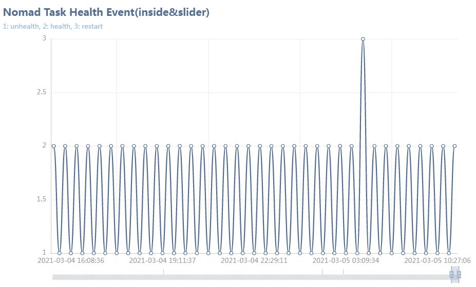

# ncProbe

ncProbe is a simple tools, have two features:

1. scan Nomad's log dir to save task health event to CSV file, record time, task event such as unhealth, health, restart, file name is task name. but only suppory one task in log files.
1. use **go-echarts** to draw task health event graph as a HTTP service, default url is **http://localhost:8081**, example as follow:

## Build

`go build -o ncProbe.exe`

## Run

`./ncProbe.exe`

## Help

`./ncProbe.exe -h`